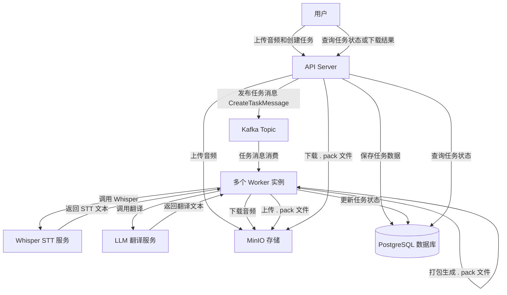

# Polyglot Translator

📚 [English](./README_EN.md) | [简体中文](./README.md)

> 通用的语音转文本与多语种翻译后端，集成 Whisper 语音识别与大型语言模型（LLM）翻译，支持任务调度与高效查询。

## ✨ 功能亮点

- 🎙️ **语音识别（STT）**：基于 [Whisper](https://github.com/openai/whisper) 模型
- 🌐 **多语种翻译**：支持多种目标语言，基于 LLM（如 OpenAI、Gemini）
- 🔍 **识别文本准确性校验**：使⽤原始⽂本信息对 STT ⽣成的内容进⾏准确性校验
- 📦 **多语种文本打包**：将所有翻译结果编码压缩为一个可快速查询的文件
- 🧩 **任务调度与管理**：支持翻译任务的创建、取消、查询
- ⚙️ **快速查询接口**：通过接口可快速获取 `语言 -> 文本编号 -> 来源（文本/音频）` 的内容

---

## 🧱 项目结构

```
polyglot-translator/
├── core                # 核心模块，实体、DTO 复用
├── api-server          # 提供 REST API，管理和发布翻译任务
└── worker              # 拉取并执行任务的无状态执行器，支持水平扩展
```

---

## 🧠 设计要点

### 🎙️ Whisper 语音识别

- [x] 使用 Whisper 模型进行语音识别
- [x] 通过 [whisper-asr-webservice](https://github.com/ahmetoner/whisper-asr-webservice) 提供 HTTP
  服务调用
- [x] 识别文本会与原始文本进行准确性校验

### 🌐 多语言翻译

- [x] 支持英文、简体中文、繁体中文、日语等
- [x] 使用 LLM （如 OpenAI、Gemini）进行翻译

### 📦 编码与打包

- [x] 所有翻译结果压缩编码为一个紧凑文件
- [x] 可快速根据语言、文本编号、文本来源查询相应文本

### 🧩 后台任务调度

- [x] worker 为无状态服务，支持水平扩展
- [x] 监控内存使用，消费任务时会检查当前节点内存，避免 OOM
- [x] 支持任务取消、失败重试、故障转移，不丢失任务

### 🗺️ 流程图



本系统通过 Kafka 实现任务异步调度，支持多个无状态 Worker 实例并行消费任务，实现高并发处理。流程如下：

1. 用户上传音频，API Server 存储音频和任务元信息。
2. API Server 发布任务消息到 Kafka。
3. 多个 Worker 实例并行消费任务，下载音频文件。
4. Worker 调用 Whisper 完成语音转文本，再调用 LLM 翻译成多语言文本。
5. Worker 将所有翻译结果打包成 .pack 文件，上传到 MinIO。
6. Worker 更新数据库任务状态，完成任务生命周期。
7. 用户可通过 API 查询任务状态，下载翻译结果。

此设计保证系统高可用、高扩展，且支持快速查询和准确性校验。

### 📦 打包设计

.pack 文件是对单个翻译任务所有多语言结果的统一压缩打包文件，支持根据语言、文本编号和内容来源（文本或音频）快速查询，方便高效地访问翻译数据。

#### 🚩 主要特点

- 🌐 多语言支持：文件按语言代码组织（如 EN、ZH、JA 等）。
- 🔢 分段索引：每种语言下按音频 ID 索引（如 0、1、2），每段包含对应文本和可选音频片段。
- 📦 压缩存储：整体文件采用压缩格式（如 Gzip），节省存储空间并提升传输效率。
- ⚡ 快速查询：根据语言和文本编号能迅速定位对应的文本或音频内容。
- 🔄 格式统一：保证下游服务或客户端能统一解析和使用翻译数据。

#### 📄 示例结构（解压后的 JSON 格式）：

```json
{
  "EN": {
    "0": {
      "TEXT": "Hello",
      "AUDIO": "Audio snippet for Hello"
    },
    "1": {
      "TEXT": "Goodbye",
      "AUDIO": "Audio snippet for Goodbye"
    }
  },
  "ZH": {
    "0": {
      "TEXT": "你好",
      "AUDIO": "对应的音频片段"
    }
  },
  "JA": {
    "0": {
      "TEXT": "こんにちは",
      "AUDIO": "対応する音声スニペット"
    }
  }
}
```

---

## 🚀 快速开始

### 🧱 环境准备

- Git
- Java 21+
- Kotlin 2.1+
- Docker、Docker Compose、Docker BuilderX
- Gemini API Key

### 📥️ 克隆项目

```bash
git clone https://github.com/bingo084/polyglot-translator.git
```

### ⚙️ 构建项目

```bash
cd polyglot-translator
./gradlew clean build -x test
```

### 🔑 设置环境变量

在 docker-compose.yml 中设置环境变量 GEMINI_API_KEY：用于调用 LLM 翻译服务

```yaml
  worker:
    build:
      context: ./worker
    image: polyglot/worker:latest
    restart: always
    environment:
      # Each instance's WORKER_ID should be unique, used for Snowflake ID generation.
      WORKER_ID: 1
      # Replace with your actual Gemini API key.
      GEMINI_API_KEY: your_gemini_api_key_here
      SPRING_DATASOURCE_URL: jdbc:postgresql://db:5432/polyglot
      SPRING_DATASOURCE_USERNAME: postgres
      SPRING_DATASOURCE_PASSWORD: postgres
      KAFKA_BOOTSTRAP_SERVERS: broker:9092
      MINIO_ACCESS_KEY: minioadmin
      MINIO_SECRET_KEY: minioadmin
    depends_on:
      - db
      - broker
      - minio
      - whisper
```

### 🐳 启动服务

```bash
docker compose up -d
```

### 📘 接口文档

系统启动后，可通过以下方式访问 API 文档：

- Swagger UI: http://localhost:8081/openapi.html
- OpenAPI YAML: http://localhost:8081/openapi.yml

---

## 🧪 测试

```bash
./gradlew test
```

---

## 📁 使用示例

1. 上传音频文件和对应原始文本。
2. 通过 API 创建翻译任务。
3. 等待后台 worker 处理完成。
4. 期间可查询任务状态、取消任务。
5. 任务完成后可查询到打包后的多语种翻译文件。
6. 通过查询接口按语言和音频 ID、文本源获取翻译内容。

---

## 📄 开源协议

MIT
