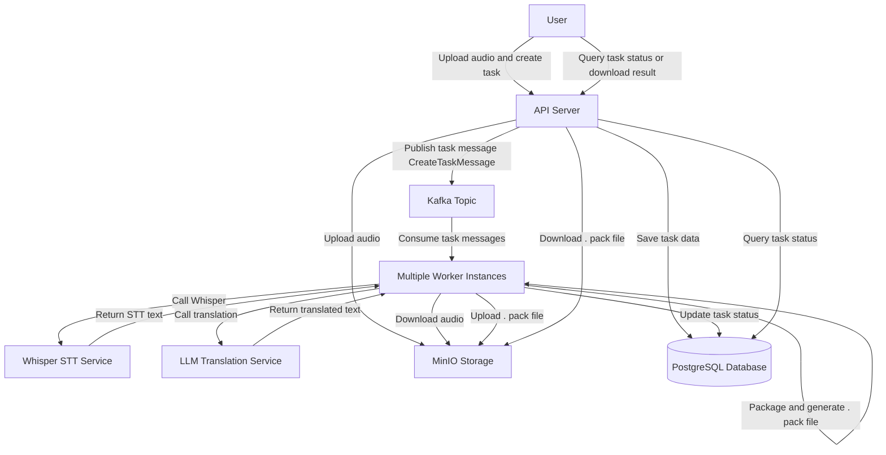

# Polyglot Translator

📚 [English](./README_EN.md) | [简体中文](./README.md)

> A universal backend for speech-to-text and multilingual translation, powered by Whisper and large
> language models (LLMs), with support for task scheduling and efficient querying.

## ✨ Features

- 🎙️ **Speech Recognition (STT)**: Based on [Whisper](https://github.com/openai/whisper)
- 🌐 **Multilingual Translation**: Supports multiple target languages using LLMs (e.g., OpenAI,
  Gemini)
- 🔍 **STT Accuracy Verification**: Validates transcribed text using original reference input
- 📦 **Multilingual Packaging**: Encodes and compresses all translations into a compact, queryable
  file
- 🧩 **Task Scheduling & Management**: Supports creation, cancellation, and querying of translation
  tasks
- ⚙️ **Fast Lookup API**: Quickly retrieve `language → text ID → source (text/audio)` content via
  API

---

## 🧱 Project Structure

```

polyglot-translator/
├── core                # Core module, shared entities and DTOs
├── api-server          # Provides REST API, manages and publishes translation tasks
└── worker              # Stateless executor that pulls and runs tasks, horizontally scalable

````

---

## 🧠 Features

### 🎙️ Whisper Speech Recognition

- [x] Use Whisper model for speech recognition
- [x] Provide HTTP interface
  via [whisper-asr-webservice](https://github.com/ahmetoner/whisper-asr-webservice)
- [x] Validate recognized text against original content

### 🌐 Multilingual Translation

- [x] Supports English, Simplified Chinese, Traditional Chinese, Japanese, etc.
- [x] Translation powered by LLMs (e.g., OpenAI, Gemini)

### 📦 Encoding & Packaging

- [x] Compress all translation results into a compact file
- [x] Fast lookup by language, text ID, and content source

### 🧩 Background Task Scheduling

- [x] Workers are stateless and support horizontal scaling
- [x] Monitor memory usage to avoid OOM during task processing
- [x] Support task cancellation, retries, failover — ensuring tasks aren't lost

### 🗺️ Workflow Diagram



This system uses Kafka to implement asynchronous task scheduling and supports multiple stateless
worker instances consuming tasks concurrently, enabling high concurrency processing. The workflow is
as follows:

1. The user uploads audio, and the API Server stores the audio and task metadata.
2. The API Server publishes the task message to Kafka.
3. Multiple worker instances consume tasks concurrently and download the audio files.
4. Workers call Whisper to perform speech-to-text, then call LLM to translate into multiple
   languages.
5. Workers package all translation results into a .pack file and upload it to MinIO.
6. Workers update the task status in the database, completing the task lifecycle.
7. Users can query task status and download translation results via the API.

This design ensures high availability, scalability, and supports fast querying and accuracy
verification.

### 📦 Packaging Design

The .pack file is a unified compressed package containing all multilingual results of a single
translation task. It supports fast querying based on language, segment index, and content source (
text or audio), enabling efficient access to translation data.

#### 🚩 Key Features

- 🌐 Multi-language support: The file is organized by language codes (e.g., EN, ZH, JA).
- 🔢 Segment indexing: Each language is indexed by audio segment ID (e.g., 0, 1, 2), with each
  segment
  containing corresponding text and optional audio snippet.
- 📦 Compressed storage: The entire file uses compression (e.g., Gzip) to save storage space and
  improve transfer efficiency.
- ⚡ Fast querying: Quickly locate text or audio content by specifying language and segment index.
- 🔄 Unified format: Ensures downstream services or clients can consistently parse and utilize the
  translation data.

#### 📄 Example structure (after decompression, in JSON format):

```json
{
  "EN": {
    "0": {
      "TEXT": "Hello",
      "AUDIO": "Audio snippet for Hello"
    },
    "1": {
      "TEXT": "Goodbye",
      "AUDIO": "Audio snippet for Goodbye"
    }
  },
  "ZH": {
    "0": {
      "TEXT": "你好",
      "AUDIO": "对应的音频片段"
    }
  },
  "JA": {
    "0": {
      "TEXT": "こんにちは",
      "AUDIO": "対応する音声スニペット"
    }
  }
}
```

---

## 🚀 Getting Started

### Prerequisites

- Java 21+
- Kotlin 2.1+
- Docker、Docker Compose、Docker BuilderX
- Gemini API Key

### Build the Project

```bash
./gradlew clean build -x test
````

### 🔑 Set Environment Variables

Set the GEMINI_API_KEY environment variable in docker-compose.yml. It is required to call the LLM
translation service.

```yaml
  worker:
    build:
      context: ./worker
    image: polyglot/worker:latest
    restart: always
    environment:
      # Each instance's WORKER_ID should be unique, used for Snowflake ID generation.
      WORKER_ID: 1
      # Replace with your actual Gemini API key.
      GEMINI_API_KEY: your_gemini_api_key_here
      SPRING_DATASOURCE_URL: jdbc:postgresql://db:5432/polyglot
      SPRING_DATASOURCE_USERNAME: postgres
      SPRING_DATASOURCE_PASSWORD: postgres
      KAFKA_BOOTSTRAP_SERVERS: broker:9092
      MINIO_ACCESS_KEY: minioadmin
      MINIO_SECRET_KEY: minioadmin
    depends_on:
      - db
      - broker
      - minio
      - whisper
```

### Start the Services

```bash
docker compose up -d
```

---

## 🧪 Testing

```bash
./gradlew test
```

---

## 📁 Example Usage

1. Upload audio file and corresponding original text
2. Create a translation task via API
3. Wait for the background worker to complete processing
4. Download the packaged multilingual result
5. Query translations by language and text ID via API

---

## 📄 License

MIT